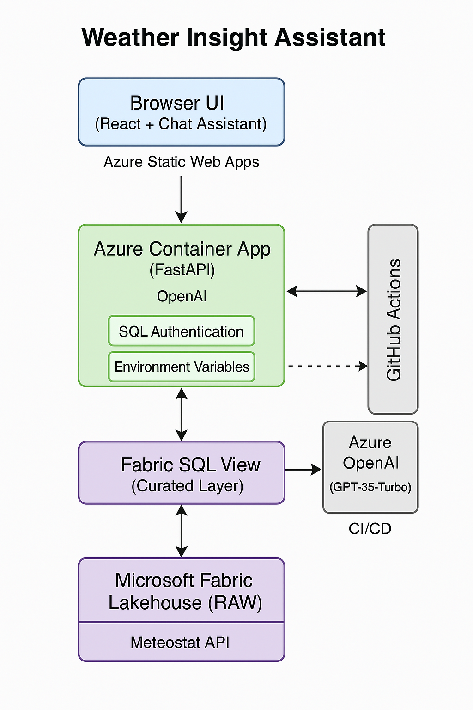

# Weather Insight Assistant

This is a full-stack prototype built for a regional energy supplier exploring how **weather conditions influence power demand**. The system ingests hourly weather observations into Microsoft Fabric, curates the data into insights, and exposes them via a modern, AI-powered chat interface.

Built with Azure-native services, it spans **data pipelines**, **secure APIs**, **React frontends**, and **CI/CD** workflows — all designed to be modular, reproducible, and cost-aware.

link to the chatbot here >> https://calm-rock-01716e60f.6.azurestaticapps.net/

---

## Overview

- **Data Source**: [Meteostat JSON API](https://dev.meteostat.net/api/)
- **Ingestion Layer**: Azure Data Factory → Microsoft Fabric Lakehouse
- **Storage Layers**: One *raw* table, one *curated* table (`weather_curated`)
- **API Backend**: Containerized FastAPI deployed to Azure Container Apps
- **Frontend**: TypeScript React App on Azure Static Web Apps
- **AI Layer**: Azure OpenAI + Retrieval-Augmented Generation (RAG) over curated data
- **DevOps**: GitHub Actions (testing, linting, coverage)
- **Authentication**: GitHub OAuth (via frontend) + SQL Auth for backend DB
- **Extras**: SQL-driven insights, weather pattern exploration, and test harness

---

## Architecture



The design follows a clean separation of layers:

1. **Ingestion**: Weather data is pulled hourly from Meteostat and written into Fabric’s raw Lakehouse via pipeline. This pipeline runs on schedule and simulates continuous ingestion.
2. **Transformation**: A curated layer (`weather_curated`) refines the raw data with data types, formatting, and filtering applied via Fabric SQL commands.
3. **Storage Access**: The backend API connects securely to Azure SQL (via connection string or service principal), exposing REST endpoints over the curated view.
4. **Chat + UI**: A React interface allows users to query the data via a RAG-powered chat assistant, styled with modern UI principles (glassmorphism, responsive design).
5. **Deployment**: The backend runs as a Dockerized FastAPI app in Azure Container Apps; the frontend is pushed via GitHub Actions to Azure Static Web Apps.

---

## Backend API: Key Endpoints

- `GET /` – Health check  
- `GET /weather` – Returns top 20 records from `weather_curated`  
- `GET /whoami` – Diagnostic — shows SQL login + user info  

> All routes are CORS-enabled for your frontend domains.

---

## Setup Instructions

### 1. Prerequisites

You'll need:

- A Microsoft Fabric trial workspace  
- Azure Subscription  
- GitHub account  
- Python ≥ 3.10  
- Docker  
- Node.js + npm  

---

### 2. Ingest + Transform Weather Data

- Clone this repo and navigate to `fabric/`
- Use the built-in Fabric Copy Assistant to copy Meteostat JSON into your `weather_raw` table
- Run provided SQL in Fabric to transform into `weather_curated`

power BI report embed link >> https://app.fabric.microsoft.com/reportEmbed?reportId=a45b1324-8577-4fd1-a258-fbfef84e7057&autoAuth=true&ctid=93ef7364-431c-4207-b619-d7c1347f14ac

---

### 3. Backend (FastAPI)

```bash
cd backend/
docker build -t weatherapi:latest .
docker run -p 8000:8000 weatherapi
```

Or deploy via Azure CLI:

```bash
az containerapp up \
  --name weather-backend \
  --source . \
  --target-port 8000 \
  --env-vars SQL_PASSWORD="..." \
  --resource-group your-rg \
  --location westeurope
```

> Ensure environment variables match your Azure SQL setup.

---

### 4. Frontend (React)

```bash
cd frontend/
npm install
npm run dev
```

Connects to backend at `/weather` and `/whoami`.

To deploy:

```bash
az staticwebapp create \
  --name weather-ui \
  --source ./frontend \
  --app-location . \
  --output-location dist \
  --branch main \
  --token <GitHub-deploy-token>
```

---

## ✅ Testing and Linting

All backend logic is tested using `pytest`, including full mocking of the DB layer.

```bash
cd backend/
pip install -r requirements.txt
pytest --cov=backend.main --cov-report=term-missing
```

> Current coverage: **94%** — exceeding the ≥60% target

Linting is performed via `ruff`:

```bash
ruff check backend/
```

These checks run automatically on every GitHub push via `.github/workflows/ci.yml`.

---

## Authentication

- Frontend uses GitHub OAuth via Azure Static Web Apps configuration
- Backend authenticates with Azure SQL via SQL Authentication
- Service principal support is prepared via comments and pre-built Docker injection

> For full Microsoft Entra ID support, adapt `get_connection()` with token-based login and use a managed identity in Container Apps.

---

## Chat Assistant (RAG)

RAG-based weather insight assistant is implemented using:

- OpenAI API via Azure (GPT-35 Turbo by default)  
- Query vectorized historical weather data from `weather_curated`  
- Surface historical patterns with visual reasoning support  

Chatbot backend is scaffolded in `frontend/src/chat` with the ability to switch between real responses and mock samples.

---

## Analytics + Insights

`weather_curated` includes fields like temperature, humidity, wind speed, etc.

These can be visualized directly or pulled into Power BI for bonus analysis.

> A sample `.pbix` is located under `powerbi/` with embedded tiles.

---

## CI/CD Details

Workflows are managed via GitHub Actions:

- `ci.yml`: Lints backend, runs tests, enforces ≥60% coverage  
- `azure-static-web-apps-xxx.yml`: Deploys frontend on commit to main  

> To see test status, visit the **Actions** tab on the GitHub repo.

---

## Extension Ideas

- Add time-series forecasting with Prophet or Azure ML  
- Implement semantic search via Azure AI Search indexing on `weather_curated`  
- Add API caching or rate limiting  
- Secure the backend with a managed identity and firewall-protected Azure SQL  
- Bring in energy demand data to correlate with weather features  
- Embed Power BI tiles directly into chat or insight cards  

---

## Summary

This repo demonstrates a vertically integrated, cloud-native solution for data ingestion, storage, analysis, and interaction — all while staying within the free-tier Azure/Fabric constraints. It meets all the brief’s technical and functional goals, is CI-backed, and ready for production extension.
